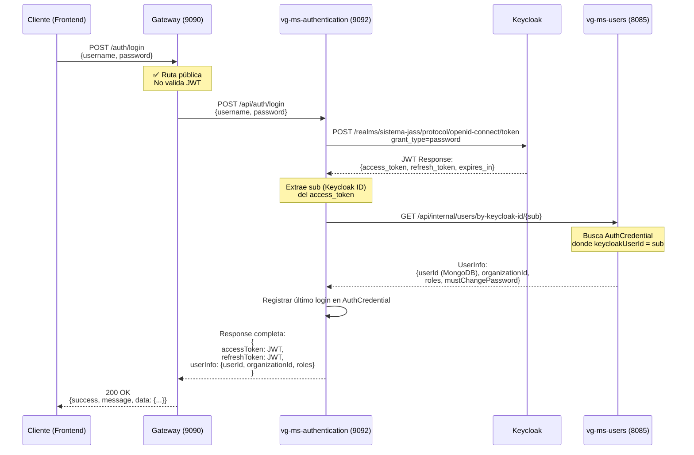
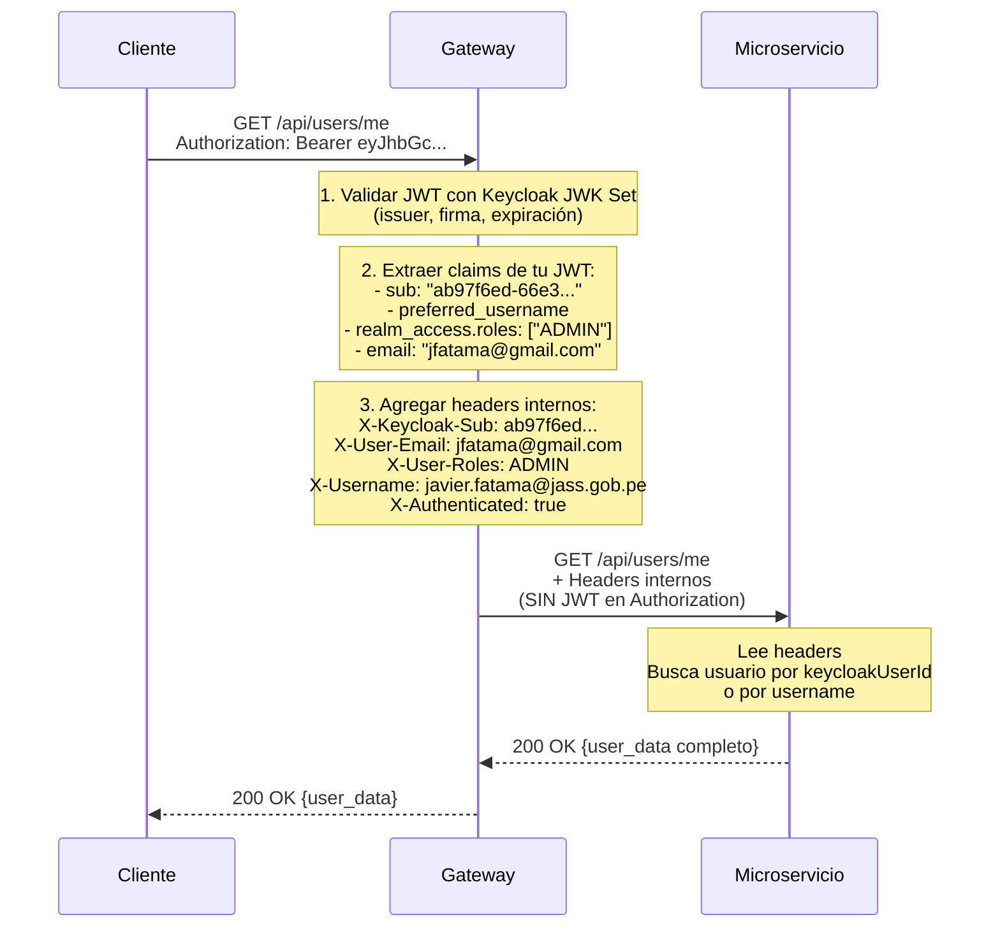
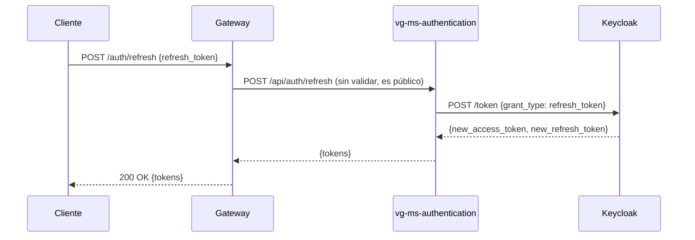
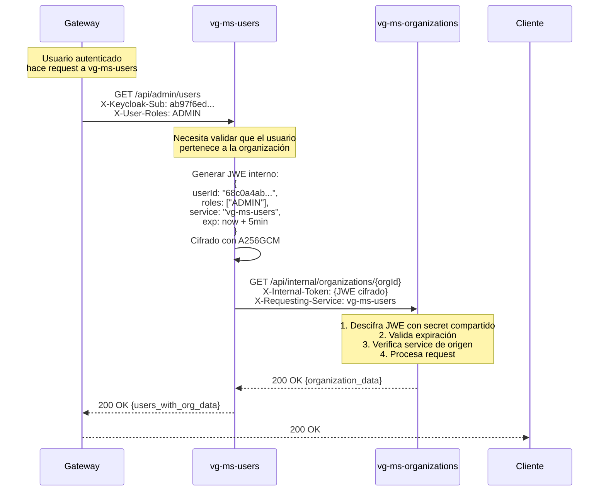
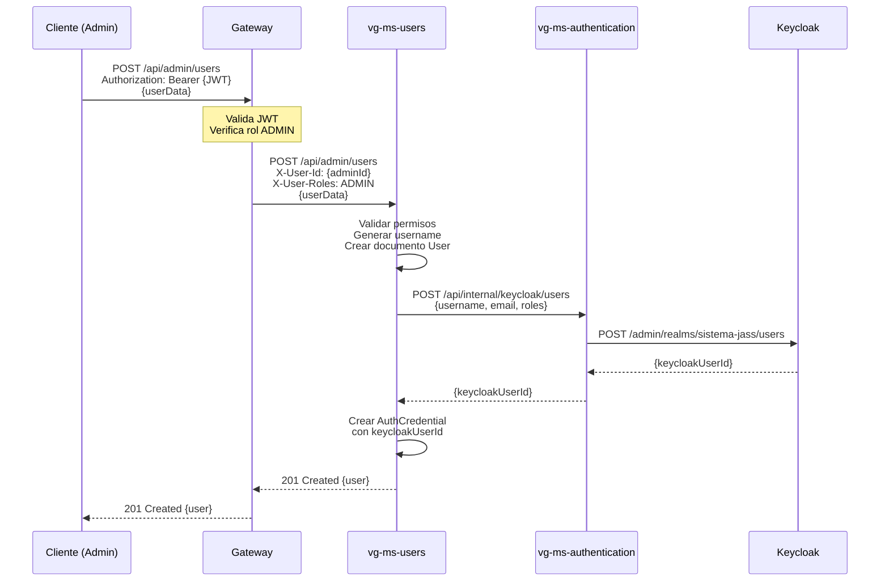

# 🔐 ARQUITECTURA DE AUTENTICACIÓN Y SEGURIDAD - SISTEMA JASS DIGITAL

## 📋 Índice

1. [Resumen Ejecutivo](#-resumen-ejecutivo)
2. [Arquitectura Actual vs Recomendada](#-arquitectura-actual-vs-recomendada)
3. [Roles y Responsabilidades de los Microservicios](#-roles-y-responsabilidades-de-los-microservicios)
4. [Flujos de Autenticación](#-flujos-de-autenticación)
5. [Seguridad por Capas (Defense in Depth)](#-seguridad-por-capas-defense-in-depth)
6. [Comunicación Interna entre Microservicios](#-comunicación-interna-entre-microservicios)
7. [Configuración de Red y Puertos](#-configuración-de-red-y-puertos)
8. [Implementación Técnica](#-implementación-técnica)
9. [Plan de Migración](#-plan-de-migración)
10. [Consideraciones de Seguridad](#-consideraciones-de-seguridad)

---

## 🎯 Resumen Ejecutivo

### Situación Actual

Tienes **10 microservicios** con autenticación y seguridad distribuida:

- ✅ **Keycloak** como Identity Provider (IdP) centralizado
- ✅ **OAuth 2.0 + JWT** para tokens de acceso externo
- ✅ **JWE** planificado para comunicación interna entre microservicios
- ❌ **Seguridad replicada** en múltiples microservicios
- ❌ **AuthCredential** duplicando información de Keycloak
- ⚠️ **Gateway** con validación JWT pero roles incompletos

### Tu JWT Real de Keycloak

Basado en tu respuesta actual de login:

```json
{
  "sub": "ab97f6ed-66e3-4484-a764-36385b10b703",  // ← Keycloak User ID
  "preferred_username": "javier.fatama@jass.gob.pe",
  "email": "jfatama@gmail.com",
  "realm_access": {
    "roles": ["offline_access", "uma_authorization", "ADMIN"]  // ← Roles de Keycloak
  },
  "scope": "profile email",
  "email_verified": true
}
```

**Y tu respuesta enriquecida incluye:**

```json
{
  "userInfo": {
    "userId": "68c0a4ab07fa2d47448b530a",        // ← MongoDB User ID
    "organizationId": "6896b2ecf3e398570ffd99d3", // ← Dato NO en Keycloak
    "roles": ["ADMIN"],
    "mustChangePassword": false                    // ← Estado de seguridad
  }
}
```

**Problema identificado:** Hay una **desconexión** entre:

- `sub` (Keycloak ID) vs `userId` (MongoDB ID)
- Información de Keycloak vs información extendida en MongoDB

### Pregunta Crítica: ¿Es necesario vg-ms-authentication?

**TU PREGUNTA:**
> "¿Sería necesario el microservicio vg-ms-authentication? ¿Cuál de los 3 MS iría conectado a Keycloak?"

**RESPUESTA CORTA:** ✅ **SÍ es necesario** vg-ms-authentication, pero con un **rol específico**.

**RESPUESTA DETALLADA:**

#### ¿Por qué SÍ es necesario?

Tu respuesta de login actual ya muestra el problema:

1. **Devuelves JWT de Keycloak** (con `sub`, `realm_access.roles`)
2. **ADEMÁS devuelves datos de MongoDB** (`userId`, `organizationId`, `mustChangePassword`)

Sin `vg-ms-authentication`, el frontend tendría que:

```
❌ 1. Login directo a Keycloak → Obtiene JWT
❌ 2. Llamar a vg-ms-users con JWT → Obtener userId, organizationId
❌ 3. Hacer 2 requests en cada login
❌ 4. Gestionar la sincronización entre Keycloak y MongoDB
```

Con `vg-ms-authentication` (actual):

```
✅ 1. Login a vg-ms-authentication → Orquesta todo
✅ 2. Devuelve JWT + userInfo enriquecido
✅ 3. Frontend tiene toda la info en 1 request
```

#### ¿Qué microservicio conecta a Keycloak?

| Microservicio | Conexión a Keycloak | Propósito |
|---------------|---------------------|-----------|
| **vg-ms-gateway** | ✅ **JWK Set** (validación JWT) | Valida tokens en cada request |
| **vg-ms-authentication** | ✅ **Admin API** (operaciones) | Login, registro, cambio password |
| **vg-ms-users** | ❌ **NO conecta** | Solo almacena `keycloakUserId` como referencia |

### Propuesta de tu Compañero (Actualizada)
>
> "Manejar toda la seguridad en el Gateway, comunicación interna con JWE sin exponer puertos"

**Análisis:** ✅ **CORRECTA** con ajustes para tu caso específico.

---

---

## 🎯 Respuesta Directa a tu Pregunta

### ¿Es necesario vg-ms-authentication?

**✅ SÍ ES NECESARIO** porque:

1. **Orquesta el login:** Keycloak (JWT) + MongoDB (datos extendidos) → 1 respuesta completa
2. **Sincroniza IDs:** Mapea `sub` (Keycloak) ↔ `userId` (MongoDB)
3. **Enriquece datos:** Agrega `organizationId`, `mustChangePassword` que NO están en JWT
4. **Gestiona operaciones:** Refresh token, cambio de password, logout en Keycloak

### ¿Cuál MS se conecta a Keycloak?

| Microservicio | Conexión | Propósito |
|---------------|----------|-----------|
| **🛡️ vg-ms-gateway** | ✅ **JWK Set URL**<br/>`/protocol/openid-connect/certs` | **Validar JWT** en cada request |
| **🔐 vg-ms-authentication** | ✅ **Admin API**<br/>`/admin/realms/sistema-jass/users` | **Operaciones:** login, registro, cambio password |
| **👥 vg-ms-users** | ❌ **NO conecta** | Solo almacena `keycloakUserId` como referencia |
| **🏢 Otros MS** | ❌ **NO conectan** | Leen headers del Gateway |

### Flujo de Tokens en tu Arquitectura

```
1️⃣ LOGIN (Cliente → Gateway → vg-ms-authentication → Keycloak)
   ↓
   JWT de Keycloak (RS256, 1 hora)
   {
     "sub": "ab97f6ed...",           ← Keycloak User ID
     "preferred_username": "javier.fatama@jass.gob.pe",
     "realm_access": {"roles": ["ADMIN"]}
   }
   +
   UserInfo de MongoDB
   {
     "userId": "68c0a4ab...",        ← MongoDB User ID
     "organizationId": "6896b2ec...", ← Dato extendido
     "mustChangePassword": false
   }

2️⃣ REQUEST AUTENTICADO (Cliente → Gateway → MS)
   ↓
   Gateway valida JWT → Extrae claims → Agrega headers:
   X-Keycloak-Sub: ab97f6ed...
   X-User-Roles: ADMIN
   X-User-Email: jfatama@gmail.com
   X-Username: javier.fatama@jass.gob.pe

3️⃣ COMUNICACIÓN INTERNA (MS → MS directo, sin Gateway)
   ↓
   JWE Interno (A256GCM, 5 minutos)
   {
     "userId": "68c0a4ab...",
     "roles": ["ADMIN"],
     "service": "vg-ms-users"
   }
   Cifrado con secret compartido
```

**Resumen:** Tienes 2 capas de seguridad:

- **Capa Externa (JWT):** Cliente → Gateway → MS (autenticación usuario)
- **Capa Interna (JWE):** MS → MS (autenticación service-to-service)

---

## 🔑 Modelo de Tokens: JWT vs JWE

### Tu Arquitectura de Seguridad (CORRECTA)

Tienes 2 tipos de tokens con propósitos diferentes:

#### 1. **JWT de Keycloak** (Acceso Externo: Cliente ↔ Gateway ↔ MS)

**Propósito:** Autenticación del usuario final desde el frontend.

```
📱 Cliente (Frontend)
    ↓ Bearer {JWT de Keycloak}
🛡️ Gateway → Valida JWT con JWK Set de Keycloak
    ↓ Headers: X-User-Id, X-User-Roles, X-Keycloak-Sub
📦 Microservicio → Lee headers, confía en Gateway
```

**Características:**

- ✅ Emitido por Keycloak
- ✅ Firmado con RS256 (clave pública)
- ✅ Expira en 1 hora (3600s)
- ✅ Contiene: `sub`, `realm_access.roles`, `email`, `preferred_username`
- ✅ Validado por Gateway en CADA request

#### 2. **JWE Interno** (Comunicación Interna: MS ↔ MS)

**Propósito:** Autenticación service-to-service cuando un MS llama a otro directamente (sin pasar por Gateway).

```
📦 vg-ms-users (necesita datos de organizaciones)
    ↓ X-Internal-Token: {JWE cifrado}
🏢 vg-ms-organizations → Descifra JWE, valida, procesa
    ↓
📦 vg-ms-users ← Respuesta
```

**Características:**

- ✅ Generado por el MS origen
- ✅ Cifrado con A256GCM
- ✅ Expira en 5 minutos (300s)
- ✅ Contiene: `userId`, `roles`, `service` (identificador del MS origen)
- ✅ Solo para comunicación interna

**Diferencia clave:**

| Aspecto | JWT de Keycloak | JWE Interno |
|---------|-----------------|-------------|
| **Emisor** | Keycloak | Microservicio |
| **Uso** | Cliente → Gateway → MS | MS → MS (directo) |
| **Validación** | Gateway (firma pública) | MS destino (clave simétrica) |
| **Duración** | 1 hora | 5 minutos |
| **Cifrado** | ❌ Solo firmado (legible) | ✅ Cifrado (no legible) |
| **Propagación** | Headers del Gateway | Header interno |

---

### Arquitectura Recomendada (Híbrida con JWT + JWE)

```
🌐 Internet
    ↓ JWT de Keycloak
┌─────────────────────────────────────────────────┐
│   🛡️ vg-ms-gateway (Puerto 9090)               │
│   - Autenticación JWT (Keycloak)                │
│   - Rate Limiting                                │
│   - CORS                                         │
│   - Routing                                      │
│   - Extracción de claims → Headers internos     │
└─────────────────────────────────────────────────┘
         ↓ (Headers: X-User-Id, X-User-Roles)
┌─────────────────────────────────────────────────┐
│   🔐 Red Interna (No expuesta a Internet)       │
│                                                  │
│   ┌──────────────────────────────────┐         │
│   │ vg-ms-authentication (9092)      │         │
│   │ - Login/Logout                   │         │
│   │ - Registro en Keycloak           │         │
│   │ - Refresh tokens                 │         │
│   │ - Reset password                 │         │
│   └──────────────────────────────────┘         │
│                ↕️                                │
│   ┌──────────────────────────────────┐         │
│   │ vg-ms-users (8085)               │         │
│   │ - CRUD usuarios                  │         │
│   │ - Gestión roles                  │         │
│   │ - AuthCredential (caché local)   │         │
│   └──────────────────────────────────┘         │
│                ↕️                                │
│   ┌──────────────────────────────────┐         │
│   │ vg-ms-organizations              │         │
│   │ vg-ms-payments-billing           │         │
│   │ vg-ms-infrastructure             │         │
│   │ ... (otros 7 MS)                 │         │
│   │ - Lógica de negocio              │         │
│   │ - Autorización opcional          │         │
│   └──────────────────────────────────┘         │
└─────────────────────────────────────────────────┘
         ↕️
┌─────────────────────────────────────────────────┐
│   🔑 Keycloak (Externo)                         │
│   - Emisor de JWT                                │
│   - Gestión de sesiones                          │
│   - Validación de credenciales                   │
└─────────────────────────────────────────────────┘
```

---

## 🏗️ Arquitectura Actual vs Recomendada

### ❌ Problemas Actuales

| Problema | Descripción | Impacto |
|----------|-------------|---------|
| **Seguridad duplicada** | Todos los MS validan JWT individualmente | 🔴 Rendimiento, complejidad |
| **AuthCredential duplicado** | Información de Keycloak en MongoDB | 🟡 Sincronización, consistencia |
| **Puertos expuestos** | Todos los MS accesibles desde internet | 🔴 **CRÍTICO: Riesgo de seguridad** |
| **Roles en múltiples lugares** | `RolesUsers` enum en 3+ microservicios | 🟡 Mantenimiento difícil |
| **Sin service-to-service auth** | MS se comunican sin autenticación interna | 🔴 Riesgo de acceso no autorizado |

### ✅ Arquitectura Recomendada

| Componente | Responsabilidad | Beneficio |
|------------|-----------------|-----------|
| **vg-ms-gateway** | Única puerta de entrada, valida JWT | 🟢 Seguridad centralizada |
| **vg-ms-authentication** | Operaciones de autenticación | 🟢 Separación de responsabilidades |
| **vg-ms-users** | Gestión de usuarios y roles | 🟢 Dominio específico |
| **MS internos** | Solo lógica de negocio | 🟢 Simplicidad, performance |
| **Red privada** | MS no accesibles desde internet | 🟢 **Seguridad por diseño** |

---

## 📦 Roles y Responsabilidades de los Microservicios

### 1. 🛡️ **vg-ms-gateway** (Puerto 9090 - PÚBLICO)

#### Responsabilidades

```yaml
DEBE HACER:
  ✅ Validar JWT de Keycloak
  ✅ Extraer claims (userId, roles, permisos)
  ✅ Agregar headers internos (X-User-Id, X-User-Roles, X-User-Email)
  ✅ Rate limiting por usuario/IP
  ✅ CORS configuration
  ✅ Routing a microservicios internos
  ✅ Circuit breaker
  ✅ Retry logic

NO DEBE HACER:
  ❌ Lógica de negocio
  ❌ Consultas a base de datos
  ❌ Validar permisos específicos de recursos
```

#### Configuración Clave

```yaml
# application.yml
server:
  port: 9090

spring:
  security:
    oauth2:
      resourceserver:
        jwt:
          issuer-uri: https://lab.vallegrande.edu.pe/jass/keycloak/realms/sistema-jass
          jwk-set-uri: https://lab.vallegrande.edu.pe/jass/keycloak/realms/sistema-jass/protocol/openid-connect/certs
```

#### Rutas Públicas (sin autenticación)

```java
/auth/**              → vg-ms-authentication (login, register, etc.)
/actuator/health      → Health checks
/docs/**              → Swagger UI
/swagger-ui/**        → Documentación
```

#### Rutas Protegidas

```java
/api/users/**         → vg-ms-users (requiere autenticación)
/api/organizations/** → vg-ms-organizations
/api/payments/**      → vg-ms-payments-billing
// ... resto de APIs
```

---

### 2. 🔐 **vg-ms-authentication** (Puerto 9092 - INTERNO)

#### Responsabilidades

```yaml
DEBE HACER:
  ✅ POST /auth/login → Autenticar con Keycloak
  ✅ POST /auth/register → Crear cuenta en Keycloak
  ✅ POST /auth/refresh → Renovar access token
  ✅ POST /auth/logout → Cerrar sesión
  ✅ POST /auth/change-password → Cambiar contraseña
  ✅ POST /auth/reset-password → Resetear contraseña
  ✅ POST /auth/first-password-change → Primera configuración
  ✅ Integración completa con Keycloak Admin API

NO DEBE HACER:
  ❌ CRUD de usuarios (eso es vg-ms-users)
  ❌ Gestión de permisos (eso es vg-ms-users)
  ❌ Validar cada request (eso es Gateway)
```

#### API Pública (expuesta por Gateway)

```http
POST   /auth/login                 # Login con username/password
POST   /auth/register              # Crear cuenta nueva
POST   /auth/refresh               # Renovar token
POST   /auth/logout                # Cerrar sesión
POST   /auth/change-password       # Cambiar contraseña
POST   /auth/reset-password        # Resetear contraseña
GET    /auth/me                    # Información del usuario actual
```

#### Configuración

```yaml
# application.yml
server:
  port: 9092

# NO exponer públicamente
# Solo accesible desde Gateway

keycloak:
  url: https://lab.vallegrande.edu.pe/jass/keycloak
  realm: sistema-jass
  admin-username: admin
  admin-password: ${KEYCLOAK_ADMIN_PASSWORD}
```

---

### 3. 👥 **vg-ms-users** (Puerto 8085 - INTERNO)

#### Responsabilidades

```yaml
DEBE HACER:
  ✅ CRUD de usuarios (crear, editar, eliminar, listar)
  ✅ Gestión de roles y permisos
  ✅ Asignación de organizaciones
  ✅ Validación de permisos específicos
  ✅ Caché de información de autenticación (AuthCredential)
  ✅ Sincronización con Keycloak (cuando sea necesario)
  ✅ Auditoría de cambios de usuarios

NO DEBE HACER:
  ❌ Login/Logout (eso es vg-ms-authentication)
  ❌ Emisión de tokens (eso es Keycloak)
  ❌ Validar JWT en cada request (eso es Gateway)
```

#### API Interna (expuesta por Gateway)

```http
# Admin
GET    /api/admin/users           # Listar usuarios
POST   /api/admin/users           # Crear usuario
PUT    /api/admin/users/:id       # Actualizar usuario
DELETE /api/admin/users/:id       # Eliminar usuario

# Common
GET    /api/common/users/me       # Mi perfil
PUT    /api/common/users/me       # Actualizar mi perfil

# Roles
POST   /api/admin/users/:id/roles # Asignar roles
DELETE /api/admin/users/:id/roles # Quitar roles
```

#### Modelo AuthCredential

```java
@Document(collection = "auth_credentials")
public class AuthCredential {
    private String authCredentialId;
    private String userId;
    private String username;
    private String keycloakUserId;        // ✅ Sincronización con Keycloak
    private List<RolesUsers> roles;       // ✅ Caché local para performance
    private List<Privileges> privileges;
    private UserStatus status;
    private LocalDateTime lastSync;       // ✅ Última sincronización con Keycloak
}
```

**Propósito de AuthCredential:**

- ✅ **Caché local** de información de Keycloak para performance
- ✅ **Información extendida** que no está en Keycloak (organizaciones, etc.)
- ✅ **Auditoría** de cambios y accesos
- ❌ **NO es la fuente de verdad** (Keycloak lo es)

---

### 4. 🏢 **Microservicios de Negocio** (Puertos internos - INTERNOS)

Lista completa:

- `vg-ms-organizations`
- `vg-ms-infrastructure`
- `vg-ms-payments-billing`
- `vg-ms-water-quality`
- `vg-ms-inventory-purchases`
- `vg-ms-distribution`
- `vg-ms-claims-incidents`

#### Responsabilidades

```yaml
DEBE HACER:
  ✅ Lógica de negocio específica
  ✅ Validación de autorización de recursos (opcional pero recomendado)
  ✅ Confiar en headers del Gateway (X-User-Id, X-User-Roles)

NO DEBE HACER:
  ❌ Validar JWT
  ❌ Autenticación
  ❌ Exponer puerto públicamente
```

#### Configuración Simplificada

```yaml
# application.yml
server:
  port: 808X  # Puerto interno, NO expuesto

# ❌ NO necesitan OAuth2 resource server
# ❌ NO necesitan Keycloak configuration
# ✅ Solo confían en headers del Gateway
```

#### Lectura de Headers

```java
@RestController
@RequestMapping("/api/v1/organizations")
public class OrganizationController {

    @GetMapping
    public Mono<List<Organization>> getOrganizations(
        @RequestHeader("X-User-Id") String userId,
        @RequestHeader("X-User-Roles") String roles,
        @RequestHeader("X-User-Email") String email
    ) {
        // ✅ El Gateway ya validó el JWT
        // ✅ Puedes confiar en estos headers
        log.info("Usuario {} con roles {} accediendo a organizaciones", userId, roles);

        return organizationService.getOrganizationsByUser(userId);
    }
}
```

---

---

## 🏢 Arquitectura Multi-Tenant (Multi-Empresa) - CRÍTICO

### Contexto: Sistema JASS Digital

Tu sistema es **multi-tenant** donde:

- Cada **JASS** (Junta Administradora de Servicios de Saneamiento) es una **organización independiente**
- Un usuario pertenece a **UNA organización específica**
- Los datos deben estar **completamente aislados** entre organizaciones
- Un ADMIN de JASS A **NO puede ver/modificar** datos de JASS B
- Solo SUPER_ADMIN puede gestionar **múltiples organizaciones**

### Tu Flujo Actual de Login (CORRECTO)

```
1. Cliente → Gateway → vg-ms-authentication
   POST /auth/login {username, password}

2. vg-ms-authentication → Keycloak
   Autentica → Obtiene JWT con sub (Keycloak ID)

3. vg-ms-authentication → vg-ms-users  ← TU FLUJO ACTUAL
   GET /internal/users/by-keycloak-id/{sub}

4. vg-ms-users → vg-ms-authentication
   Responde: {
     userId: "68c0a4ab...",
     organizationId: "6896b2ec...",  ← CRÍTICO para multi-tenant
     roles: ["ADMIN"],
     organizationName: "JASS San Martín"
   }

5. vg-ms-authentication → Cliente
   {
     accessToken: JWT,
     userInfo: {userId, organizationId, roles, ...}
   }
```

**Esto es CORRECTO**, pero tiene una limitación de performance y seguridad.

---

### Problema: organizationId NO está en el JWT

**JWT actual de Keycloak:**

```json
{
  "sub": "ab97f6ed-66e3-4484-a764-36385b10b703",
  "preferred_username": "javier.fatama@jass.gob.pe",
  "realm_access": {"roles": ["ADMIN"]},
  "email": "jfatama@gmail.com"
  // ❌ NO tiene organizationId
}
```

**Consecuencias:**

1. **Gateway no conoce la organización:**
   - Gateway valida JWT pero NO sabe a qué organización pertenece el usuario
   - Headers propagados NO incluyen `X-Organization-Id`
   - Cada MS debe consultar MongoDB para obtener organizationId

2. **Posible brecha de seguridad:**
   - Un usuario podría intentar acceder a recursos de otra organización
   - Sin organizationId en headers, cada MS debe validar manualmente

3. **Performance:**
   - Cada request requiere consulta adicional a MongoDB para obtener organizationId

---

### Solución: Custom Claims en Keycloak

#### Opción A: Custom Attribute en Keycloak (RECOMENDADO)

**1. Configurar Keycloak para incluir organizationId en JWT**

En Keycloak Admin Console:

```
1. Realms → sistema-jass → Client Scopes → Create
   Name: organization-scope

2. Mappers → Create Protocol Mapper
   Name: organization-mapper
   Mapper Type: User Attribute
   User Attribute: organizationId
   Token Claim Name: organizationId
   Claim JSON Type: String
   Add to ID token: ON
   Add to access token: ON
   Add to userinfo: ON

3. Clients → jass-users-service → Client Scopes
   Add "organization-scope" to Assigned Default Client Scopes
```

**2. Sincronizar organizationId al crear usuario en Keycloak**

```java
// En vg-ms-authentication cuando crea usuario
@Service
public class KeycloakDomainServiceImpl {

    public Mono<String> createUserInKeycloak(
        String username,
        String email,
        String password,
        List<String> roles,
        String organizationId  // ← NUEVO parámetro
    ) {
        UserRepresentation user = new UserRepresentation();
        user.setUsername(username);
        user.setEmail(email);
        user.setEnabled(true);
        user.setEmailVerified(true);

        // ✅ Agregar organizationId como atributo personalizado
        Map<String, List<String>> attributes = new HashMap<>();
        attributes.put("organizationId", List.of(organizationId));
        user.setAttributes(attributes);

        // Crear credencial
        CredentialRepresentation credential = new CredentialRepresentation();
        credential.setType(CredentialRepresentation.PASSWORD);
        credential.setValue(password);
        credential.setTemporary(false);
        user.setCredentials(List.of(credential));

        // Crear usuario en Keycloak
        Response response = keycloakClient
            .realm(realm)
            .users()
            .create(user);

        String keycloakUserId = extractUserId(response);

        // Asignar roles
        assignRolesToUser(keycloakUserId, roles);

        return Mono.just(keycloakUserId);
    }
}
```

**3. JWT resultante (con organizationId):**

```json
{
  "sub": "ab97f6ed-66e3-4484-a764-36385b10b703",
  "preferred_username": "javier.fatama@jass.gob.pe",
  "realm_access": {"roles": ["ADMIN"]},
  "email": "jfatama@gmail.com",
  "organizationId": "6896b2ecf3e398570ffd99d3"  // ✅ NUEVO
}
```

**4. Gateway extrae organizationId del JWT:**

```java
@Component
public class CustomAuthenticationFilter implements GlobalFilter, Ordered {

    @Override
    public Mono<Void> filter(ServerWebExchange exchange, GatewayFilterChain chain) {
        return exchange.getPrincipal()
            .cast(JwtAuthenticationToken.class)
            .flatMap(authentication -> {
                Jwt jwt = (Jwt) authentication.getPrincipal();

                // Extraer claims
                String keycloakSub = jwt.getClaimAsString("sub");
                String email = jwt.getClaimAsString("email");
                String username = jwt.getClaimAsString("preferred_username");
                String organizationId = jwt.getClaimAsString("organizationId");  // ✅ NUEVO
                List<String> roles = extractRoles(jwt);

                // Validar que organizationId existe
                if (organizationId == null || organizationId.isEmpty()) {
                    log.warn("JWT sin organizationId para usuario {}", username);
                    return Mono.error(new UnauthorizedException("Missing organization context"));
                }

                // Agregar headers internos
                ServerHttpRequest request = exchange.getRequest().mutate()
                    .header("X-Keycloak-Sub", keycloakSub)
                    .header("X-User-Email", email)
                    .header("X-Username", username)
                    .header("X-User-Roles", String.join(",", roles))
                    .header("X-Organization-Id", organizationId)  // ✅ CRÍTICO
                    .header("X-Authenticated", "true")
                    .build();

                log.info("Request autenticado: user={}, org={}, roles={}",
                    username, organizationId, roles);

                return chain.filter(exchange.mutate().request(request).build());
            })
            .onErrorResume(e -> {
                log.error("Error en autenticación: {}", e.getMessage());
                return Mono.error(new UnauthorizedException("Invalid authentication"));
            });
    }

    @Override
    public int getOrder() {
        return -100;
    }
}
```

---

### Seguridad Multi-Tenant en Microservicios

#### Nivel 1: Headers Propagados (desde Gateway)

```http
X-Keycloak-Sub: ab97f6ed-66e3-4484-a764-36385b10b703
X-User-Email: jfatama@gmail.com
X-Username: javier.fatama@jass.gob.pe
X-User-Roles: ADMIN
X-Organization-Id: 6896b2ecf3e398570ffd99d3  ← CRUCIAL
X-Authenticated: true
```

#### Nivel 2: Row-Level Security (RLS) - Filtrado Automático

**Todos los queries DEBEN filtrar por organizationId:**

```java
// ❌ MAL: Sin filtro de organización
userRepository.findAll();

// ✅ BIEN: Con filtro de organización
userRepository.findByOrganizationId(organizationId);
```

**Implementación de Interceptor (Spring Data MongoDB):**

```java
@Component
public class TenantFilter {

    private static final ThreadLocal<String> currentOrganizationId = new ThreadLocal<>();

    public static void setOrganizationId(String organizationId) {
        currentOrganizationId.set(organizationId);
    }

    public static String getOrganizationId() {
        return currentOrganizationId.get();
    }

    public static void clear() {
        currentOrganizationId.remove();
    }
}

@Component
public class TenantInterceptor implements WebFilter {

    @Override
    public Mono<Void> filter(ServerWebExchange exchange, WebFilterChain chain) {
        String organizationId = exchange.getRequest()
            .getHeaders()
            .getFirst("X-Organization-Id");

        if (organizationId != null) {
            TenantFilter.setOrganizationId(organizationId);
        }

        return chain.filter(exchange)
            .doFinally(signalType -> TenantFilter.clear());
    }
}

// Aspecto para inyectar filtro automáticamente
@Aspect
@Component
public class TenantAspect {

    @Around("@annotation(TenantSecured)")
    public Object enforceTenant(ProceedingJoinPoint joinPoint) throws Throwable {
        String organizationId = TenantFilter.getOrganizationId();

        if (organizationId == null) {
            throw new UnauthorizedException("Missing organization context");
        }

        // Continuar con el método
        return joinPoint.proceed();
    }
}

// Uso en servicio
@Service
public class UserService {

    @TenantSecured  // ✅ Valida que organizationId existe
    public Mono<List<User>> getAllUsers() {
        String organizationId = TenantFilter.getOrganizationId();
        return userRepository.findByOrganizationId(organizationId);
    }
}
```

#### Nivel 3: Validación de Autorización por Organización

```java
@Service
@RequiredArgsConstructor
public class OrganizationAuthorizationService {

    private final UserRepository userRepository;

    /**
     * Valida que el usuario pertenece a la organización del recurso
     */
    public Mono<Void> validateResourceAccess(
        String userId,
        String organizationId,
        String resourceOrganizationId
    ) {
        // SUPER_ADMIN puede acceder a cualquier organización
        return userRepository.findById(userId)
            .flatMap(user -> {
                if (user.hasRole(RolesUsers.SUPER_ADMIN)) {
                    return Mono.empty();  // ✅ Permitido
                }

                // Verificar que la organización del usuario coincide con la del recurso
                if (!organizationId.equals(resourceOrganizationId)) {
                    return Mono.error(new ForbiddenException(
                        "No puedes acceder a recursos de otra organización"
                    ));
                }

                return Mono.empty();  // ✅ Permitido
            });
    }

    /**
     * Valida que el usuario puede gestionar otro usuario
     */
    public Mono<Void> validateUserManagement(
        String adminId,
        String adminOrganizationId,
        String targetUserId
    ) {
        return userRepository.findById(targetUserId)
            .flatMap(targetUser -> {
                // Verificar que ambos están en la misma organización
                if (!adminOrganizationId.equals(targetUser.getOrganizationId())) {
                    return Mono.error(new ForbiddenException(
                        "No puedes gestionar usuarios de otra organización"
                    ));
                }
                return Mono.empty();
            });
    }
}

// Uso en controller
@RestController
@RequestMapping("/api/admin/users")
@RequiredArgsConstructor
public class AdminUserController {

    private final UserService userService;
    private final HeaderExtractor headerExtractor;
    private final OrganizationAuthorizationService authService;

    @PutMapping("/{userId}")
    public Mono<ResponseEntity<User>> updateUser(
        @PathVariable String userId,
        @RequestBody UpdateUserRequest request,
        ServerHttpRequest httpRequest
    ) {
        String adminId = headerExtractor.getUserId(httpRequest);
        String adminOrgId = headerExtractor.getOrganizationId(httpRequest);

        // ✅ Validar que el admin puede gestionar este usuario
        return authService.validateUserManagement(adminId, adminOrgId, userId)
            .then(userService.updateUser(userId, request))
            .map(ResponseEntity::ok);
    }

    @GetMapping("/{resourceId}/payments")
    public Mono<ResponseEntity<List<Payment>>> getResourcePayments(
        @PathVariable String resourceId,
        ServerHttpRequest httpRequest
    ) {
        String userId = headerExtractor.getUserId(httpRequest);
        String userOrgId = headerExtractor.getOrganizationId(httpRequest);

        // ✅ Validar que el recurso pertenece a la organización del usuario
        return paymentService.getResourceOrganizationId(resourceId)
            .flatMap(resourceOrgId ->
                authService.validateResourceAccess(userId, userOrgId, resourceOrgId)
            )
            .then(paymentService.getPaymentsByResource(resourceId))
            .map(ResponseEntity::ok);
    }
}
```

---

### Estructura de Datos Multi-Tenant

#### MongoDB: Todos los documentos deben tener organizationId

```java
// User
@Document(collection = "users")
public class User {
    @Id
    private String id;
    private String organizationId;  // ✅ OBLIGATORIO
    private String firstName;
    private String lastName;
    // ...
}

// AuthCredential
@Document(collection = "auth_credentials")
public class AuthCredential {
    @Id
    private String authCredentialId;
    private String userId;
    private String keycloakUserId;
    private String organizationId;  // ✅ OBLIGATORIO
    // ...
}

// Payment
@Document(collection = "payments")
public class Payment {
    @Id
    private String id;
    private String organizationId;  // ✅ OBLIGATORIO
    private String userId;
    private Double amount;
    // ...
}

// Organization
@Document(collection = "organizations")
public class Organization {
    @Id
    private String id;  // Este ES el organizationId
    private String name;
    private String code;
    private OrganizationStatus status;
    // ...
}
```

#### Índices de MongoDB para Performance

```javascript
// Crear índices compuestos con organizationId
db.users.createIndex({ "organizationId": 1, "status": 1 });
db.users.createIndex({ "organizationId": 1, "keycloakUserId": 1 }, { unique: true });
db.auth_credentials.createIndex({ "organizationId": 1, "keycloakUserId": 1 }, { unique: true });
db.payments.createIndex({ "organizationId": 1, "userId": 1 });
db.payments.createIndex({ "organizationId": 1, "createdAt": -1 });
```

---

### Flujo Completo Multi-Tenant

#### 1. Crear Organización (SUPER_ADMIN)

```
POST /api/super-admin/organizations
{
  "name": "JASS San Martín",
  "code": "JASS-SM",
  "address": "...",
  "contactEmail": "admin@jass-sanmartin.pe"
}

→ Crea Organization en MongoDB
→ organizationId: "6896b2ecf3e398570ffd99d3"
```

#### 2. Crear Usuario ADMIN de la Organización

```
POST /api/super-admin/users
{
  "firstName": "Javier",
  "lastName": "Fatama",
  "email": "jfatama@gmail.com",
  "dni": "12345678",
  "organizationId": "6896b2ecf3e398570ffd99d3",  ← ASIGNADO
  "roles": ["ADMIN"]
}

→ vg-ms-users:
   1. Crea User en MongoDB con organizationId
   2. Genera username: "javier.fatama@jass.gob.pe"

→ vg-ms-authentication (llamado por vg-ms-users):
   1. Crea usuario en Keycloak
   2. Agrega organizationId como atributo personalizado
   3. Asigna roles en Keycloak
   4. Devuelve keycloakUserId

→ vg-ms-users:
   1. Crea AuthCredential con keycloakUserId y organizationId
```

#### 3. Login del Usuario ADMIN

```
POST /auth/login
{
  "username": "javier.fatama@jass.gob.pe",
  "password": "SecurePass123!"
}

→ vg-ms-authentication:
   1. Autentica en Keycloak
   2. Obtiene JWT con organizationId en claims
   3. (Opcional) Consulta vg-ms-users para datos extendidos
   4. Devuelve: {
        accessToken: JWT (con organizationId),
        userInfo: {userId, organizationId, roles}
      }
```

#### 4. Request Autenticado con Contexto Organizacional

```
GET /api/admin/users
Authorization: Bearer {JWT con organizationId}

→ Gateway:
   1. Valida JWT
   2. Extrae organizationId del JWT
   3. Agrega headers:
      X-Organization-Id: 6896b2ec...
      X-User-Roles: ADMIN

→ vg-ms-users:
   1. Lee X-Organization-Id del header
   2. Query: users.findByOrganizationId("6896b2ec...")
   3. Devuelve SOLO usuarios de JASS San Martín
```

---

### Comparación: Con y Sin organizationId en JWT

| Aspecto | Sin organizationId en JWT | Con organizationId en JWT |
|---------|---------------------------|---------------------------|
| **Performance** | ❌ Query adicional en cada request | ✅ organizationId disponible inmediatamente |
| **Seguridad** | ⚠️ Depende de query correcto | ✅ Validación en Gateway |
| **Logs** | ⚠️ Difícil segregar por organización | ✅ Fácil filtrar logs por org |
| **Rate Limiting** | ❌ Solo por usuario | ✅ Por usuario Y por organización |
| **Complejidad** | ✅ Más simple (sin custom claims) | ⚠️ Requiere configurar Keycloak |
| **Escalabilidad** | ❌ Consulta MongoDB en cada request | ✅ Sin consultas adicionales |

**Recomendación:** ✅ **Usar organizationId en JWT** (Opción A)

---

## 🔄 Flujos de Autenticación

### Flujo 1: Login (Primera vez) - REAL CON TU JWT



**Tu respuesta actual:**

```json
{
  "success": true,
  "message": "Login exitoso",
  "data": {
    "accessToken": "eyJhbGc...",  // ← JWT de Keycloak (RS256)
    "refreshToken": "eyJhbGc...", // ← Refresh token de Keycloak
    "tokenType": "Bearer",
    "expiresIn": 3600,
    "userInfo": {
      "userId": "68c0a4ab07fa2d47448b530a",        // ← MongoDB ID
      "username": "javier.fatama@jass.gob.pe",
      "email": "jfatama@gmail.com",
      "organizationId": "6896b2ecf3e398570ffd99d3", // ← Dato extendido
      "roles": ["ADMIN"],
      "mustChangePassword": false,
      "lastLogin": "2025-10-24T01:05:58.046796839"
    }
  }
}
```

**Mapeo crítico (debe existir en AuthCredential):**

```java
@Document(collection = "auth_credentials")
public class AuthCredential {
    private String authCredentialId;
    private String userId;              // MongoDB User ID: "68c0a4ab..."
    private String keycloakUserId;      // Keycloak sub: "ab97f6ed-66e3..."  ← CLAVE
    private String username;            // "javier.fatama@jass.gob.pe"
    private String organizationId;      // "6896b2ecf3e398570ffd99d3"
    private List<RolesUsers> roles;     // ["ADMIN"]
    private boolean mustChangePassword; // false
    private LocalDateTime lastLoginAt;
}
```

**Duración:** ~500-800ms

**¿Por qué necesitas vg-ms-authentication?**

1. ✅ **Orquestación:** Combina Keycloak JWT + datos de MongoDB en 1 respuesta
2. ✅ **Enriquecimiento:** Agrega `organizationId`, `mustChangePassword` que NO están en Keycloak
3. ✅ **Auditoría:** Registra `lastLogin` en MongoDB
4. ✅ **Sincronización:** Mapea `sub` (Keycloak) ↔ `userId` (MongoDB)

---

### Flujo 2: Request Autenticado (Cada petición) - CON TU JWT REAL



**Tu JWT decodificado (claims importantes):**

```json
{
  "sub": "ab97f6ed-66e3-4484-a764-36385b10b703",     // ← ID de Keycloak
  "preferred_username": "javier.fatama@jass.gob.pe", // ← Username único
  "email": "jfatama@gmail.com",
  "realm_access": {
    "roles": ["offline_access", "uma_authorization", "ADMIN"]  // ← Roles
  },
  "iss": "https://lab.vallegrande.edu.pe/jass/keycloak/realms/sistema-jass",
  "exp": 1761271556  // ← Expiración
}
```

**Headers que el Gateway debe propagar:**

```http
X-Keycloak-Sub: ab97f6ed-66e3-4484-a764-36385b10b703
X-User-Email: jfatama@gmail.com
X-User-Roles: ADMIN
X-Username: javier.fatama@jass.gob.pe
X-Authenticated: true
```

**⚠️ IMPORTANTE:** El Gateway NO tiene el `userId` de MongoDB en el JWT. El microservicio debe:

1. **Opción A (Recomendada):** Buscar en su base de datos por `keycloakUserId = sub`
2. **Opción B:** Buscar por `username = preferred_username`

**Duración:** ~50ms (validación JWT local, sin consultar Keycloak)

---

### Flujo 3: Refresh Token



**Duración:** ~300ms

---

### Flujo 4: Comunicación Interna con JWE (MS a MS sin Gateway)



**Generación de JWE en vg-ms-users:**

```java
@Service
@RequiredArgsConstructor
public class InternalTokenService {

    @Value("${internal.security.jwe.secret}")
    private String jweSecret;

    public String generateInternalToken(String userId, List<String> roles, String targetService) {
        try {
            // Header JWE
            JWEHeader header = new JWEHeader.Builder(
                JWEAlgorithm.DIR,
                EncryptionMethod.A256GCM
            ).contentType("JWT").build();

            // Claims
            JWTClaimsSet claims = new JWTClaimsSet.Builder()
                .subject(userId)
                .issuer("vg-ms-users")
                .audience(targetService)
                .claim("roles", roles)
                .claim("service", "vg-ms-users")
                .expirationTime(Date.from(Instant.now().plusSeconds(300))) // 5 min
                .issueTime(new Date())
                .build();

            // Cifrar
            JWEObject jweObject = new JWEObject(header, new Payload(claims.toJSONObject()));

            byte[] secretKey = jweSecret.getBytes(StandardCharsets.UTF_8);
            DirectEncrypter encrypter = new DirectEncrypter(secretKey);
            jweObject.encrypt(encrypter);

            return jweObject.serialize();

        } catch (Exception e) {
            throw new RuntimeException("Error generating internal token", e);
        }
    }
}
```

**Validación de JWE en vg-ms-organizations:**

```java
@Component
public class InternalTokenFilter implements WebFilter {

    @Value("${internal.security.jwe.secret}")
    private String jweSecret;

    @Override
    public Mono<Void> filter(ServerWebExchange exchange, WebFilterChain chain) {
        String path = exchange.getRequest().getPath().toString();

        // Solo validar rutas internas
        if (!path.startsWith("/api/internal/")) {
            return chain.filter(exchange);
        }

        String internalToken = exchange.getRequest().getHeaders().getFirst("X-Internal-Token");

        if (internalToken == null) {
            return Mono.error(new UnauthorizedException("Missing internal token"));
        }

        return validateAndExtractClaims(internalToken)
            .flatMap(claims -> {
                // Agregar claims al contexto
                ServerHttpRequest request = exchange.getRequest().mutate()
                    .header("X-Internal-UserId", claims.getSubject())
                    .header("X-Internal-Service", claims.getStringClaim("service"))
                    .header("X-Internal-Roles", String.join(",", claims.getStringListClaim("roles")))
                    .build();

                return chain.filter(exchange.mutate().request(request).build());
            })
            .onErrorResume(e -> Mono.error(new UnauthorizedException("Invalid internal token")));
    }

    private Mono<JWTClaimsSet> validateAndExtractClaims(String jweToken) {
        return Mono.fromCallable(() -> {
            JWEObject jweObject = JWEObject.parse(jweToken);

            byte[] secretKey = jweSecret.getBytes(StandardCharsets.UTF_8);
            DirectDecrypter decrypter = new DirectDecrypter(secretKey);
            jweObject.decrypt(decrypter);

            JWTClaimsSet claims = JWTClaimsSet.parse(jweObject.getPayload().toJSONObject());

            // Validar expiración
            if (claims.getExpirationTime().before(new Date())) {
                throw new TokenExpiredException("Internal token expired");
            }

            return claims;
        });
    }
}
```

**Configuración compartida (todos los MS internos):**

```yaml
# application.yml
internal:
  security:
    jwe:
      secret: ${INTERNAL_JWE_SECRET:jass-internal-secret-change-in-production-32-chars-minimum}
      expiration: 300  # 5 minutos
```

**⚠️ CRÍTICO:**

- El `INTERNAL_JWE_SECRET` debe ser el **MISMO** en todos los microservicios
- Debe tener mínimo 32 caracteres para A256GCM
- En producción: usar AWS Secrets Manager o HashiCorp Vault

---

### Flujo 5: Crear Usuario (Por Admin)



**Duración:** ~800ms

---

## 🛡️ Seguridad por Capas (Defense in Depth)

### Capa 1: Red (Network Layer)

```yaml
Configuración Docker/Kubernetes:
  ✅ Gateway expuesto: 0.0.0.0:9090
  ✅ MS internos: Solo red interna
  ✅ Firewall: Bloquear puertos 8085, 9092, etc. desde internet
```

```yaml
# docker-compose.yml (Ejemplo)
services:
  gateway:
    image: vg-ms-gateway
    ports:
      - "9090:9090"  # ✅ Expuesto públicamente
    networks:
      - jass-public
      - jass-internal

  authentication:
    image: vg-ms-authentication
    # ❌ NO exponer puerto públicamente
    networks:
      - jass-internal  # ✅ Solo red interna

  users:
    image: vg-ms-users
    # ❌ NO exponer puerto
    networks:
      - jass-internal

networks:
  jass-public:
    driver: bridge
  jass-internal:
    driver: bridge
    internal: true  # ✅ Red privada
```

---

### Capa 2: Gateway (Authentication Layer)

```java
// SecurityConfig.java en vg-ms-gateway
@Bean
public SecurityWebFilterChain securityWebFilterChain(ServerHttpSecurity http) {
    return http
        .authorizeExchange(exchanges -> exchanges
            // ✅ Público
            .pathMatchers("/auth/**").permitAll()
            .pathMatchers("/actuator/health").permitAll()
            .pathMatchers("/docs/**").permitAll()

            // ✅ Requiere autenticación
            .pathMatchers("/api/admin/**").hasRole("ADMIN")
            .pathMatchers("/api/common/**").hasAnyRole("ADMIN", "CLIENT")
            .anyExchange().authenticated()
        )
        .oauth2ResourceServer(oauth2 -> oauth2.jwt())
        .build();
}
```

---

### Capa 3: Microservicio (Authorization Layer - OPCIONAL)

```java
// Validación adicional en microservicio específico
@Service
public class OrganizationService {

    public Mono<Organization> getOrganization(String orgId, String userId, List<String> roles) {
        // ✅ El Gateway ya autenticó
        // ✅ Aquí validamos permisos específicos del recurso

        return organizationRepository.findById(orgId)
            .flatMap(org -> {
                // Validar que el usuario puede acceder a esta organización
                if (!canAccessOrganization(userId, roles, org)) {
                    return Mono.error(new ForbiddenException("No tienes acceso a esta organización"));
                }
                return Mono.just(org);
            });
    }

    private boolean canAccessOrganization(String userId, List<String> roles, Organization org) {
        if (roles.contains("SUPER_ADMIN")) return true;
        if (roles.contains("ADMIN") && org.getAdminIds().contains(userId)) return true;
        if (roles.contains("CLIENT") && org.getClientIds().contains(userId)) return true;
        return false;
    }
}
```

---

## 🔗 Comunicación Interna entre Microservicios

### Opción 1: Headers de Confianza (RECOMENDADO para empezar)

**Ventajas:**

- ✅ Simple de implementar
- ✅ Performance óptimo
- ✅ No requiere gestión de tokens internos

**Desventajas:**

- ⚠️ Depende de red privada segura
- ⚠️ Si MS es comprometido, puede falsificar headers

```java
// vg-ms-users llama a vg-ms-organizations
@Service
public class UserService {

    private final WebClient webClient;

    public Mono<Organization> getUserOrganization(String orgId, String userId, String roles) {
        return webClient.get()
            .uri("http://vg-ms-organizations:8087/api/internal/organizations/{id}", orgId)
            .header("X-User-Id", userId)          // ✅ Pasar userId
            .header("X-User-Roles", roles)        // ✅ Pasar roles
            .header("X-Internal-Call", "true")    // ✅ Identificar llamada interna
            .retrieve()
            .bodyToMono(Organization.class);
    }
}
```

---

### Opción 2: JWE (JSON Web Encryption) - OPCIONAL (Mayor seguridad)

**Ventajas:**

- ✅ Tokens cifrados end-to-end
- ✅ Firma digital para verificar origen
- ✅ No se pueden falsificar

**Desventajas:**

- ❌ Más complejo de implementar
- ❌ Overhead de performance (mínimo)
- ❌ Gestión de claves

```yaml
# application.yml (cada MS)
internal:
  security:
    jwe:
      secret: ${INTERNAL_JWE_SECRET}  # ⚠️ Mismo secret en todos los MS
      expiration: 300  # 5 minutos
      issuer: "vg-ms-users"
```

```java
// Generación de JWE (en MS origen)
@Service
public class InternalTokenService {

    public String generateInternalToken(String userId, List<String> roles) {
        JWEHeader header = new JWEHeader(JWEAlgorithm.DIR, EncryptionMethod.A256GCM);

        JWTClaimsSet claims = new JWTClaimsSet.Builder()
            .subject(userId)
            .claim("roles", roles)
            .issuer("vg-ms-users")
            .audience("vg-ms-organizations")
            .expirationTime(Date.from(Instant.now().plusSeconds(300)))
            .build();

        // Cifrar y firmar
        JWEObject jweObject = new JWEObject(header, new Payload(claims.toJSONObject()));
        jweObject.encrypt(new DirectEncrypter(secretKey));

        return jweObject.serialize();
    }
}

// Llamada con JWE
public Mono<Organization> getUserOrganization(String orgId, String userId, List<String> roles) {
    String internalToken = internalTokenService.generateInternalToken(userId, roles);

    return webClient.get()
        .uri("http://vg-ms-organizations:8087/api/internal/organizations/{id}", orgId)
        .header("X-Internal-Token", internalToken)  // ✅ Token cifrado
        .retrieve()
        .bodyToMono(Organization.class);
}
```

**Recomendación:** Empezar con **Opción 1** (Headers de Confianza) y migrar a **Opción 2** (JWE) en producción si es necesario.

---

## 🌐 Configuración de Red y Puertos

### Puertos Asignados

| Microservicio | Puerto | Exposición | Razón |
|---------------|--------|------------|-------|
| `vg-ms-gateway` | 9090 | **PÚBLICO** | Única puerta de entrada |
| `vg-ms-authentication` | 9092 | **INTERNO** | Solo Gateway accede |
| `vg-ms-users` | 8085 | **INTERNO** | Solo Gateway/MS acceden |
| `vg-ms-organizations` | 8086 | **INTERNO** | Solo Gateway/MS acceden |
| `vg-ms-infrastructure` | 8087 | **INTERNO** | Solo Gateway/MS acceden |
| `vg-ms-payments-billing` | 8088 | **INTERNO** | Solo Gateway/MS acceden |
| `vg-ms-water-quality` | 8089 | **INTERNO** | Solo Gateway/MS acceden |
| `vg-ms-inventory-purchases` | 8090 | **INTERNO** | Solo Gateway/MS acceden |
| `vg-ms-distribution` | 8091 | **INTERNO** | Solo Gateway/MS acceden |
| `vg-ms-claims-incidents` | 8093 | **INTERNO** | Solo Gateway/MS acceden |

---

### Configuración de Firewall (Linux/iptables)

```bash
#!/bin/bash
# firewall-config.sh

# ✅ Permitir Gateway público
iptables -A INPUT -p tcp --dport 9090 -j ACCEPT

# ❌ Bloquear MS internos desde internet
iptables -A INPUT -p tcp --dport 9092 -s 127.0.0.0/8 -j ACCEPT
iptables -A INPUT -p tcp --dport 9092 -j DROP

iptables -A INPUT -p tcp --dport 8085:8093 -s 127.0.0.0/8 -j ACCEPT
iptables -A INPUT -p tcp --dport 8085:8093 -j DROP

# ✅ Permitir comunicación interna (Docker network)
iptables -A INPUT -s 172.18.0.0/16 -j ACCEPT
```

---

### Docker Compose (Ejemplo completo)

```yaml
# docker-compose.yml
version: '3.8'

networks:
  jass-public:
    driver: bridge
  jass-internal:
    driver: bridge
    internal: false  # Permite salida a internet (para Keycloak)

services:
  # ========================
  # 🛡️ GATEWAY (PÚBLICO)
  # ========================
  gateway:
    image: vg-ms-gateway:latest
    container_name: vg-ms-gateway
    ports:
      - "9090:9090"  # ✅ ÚNICO PUERTO EXPUESTO
    environment:
      - SPRING_PROFILES_ACTIVE=prod
      - KEYCLOAK_JWK_URI=https://lab.vallegrande.edu.pe/jass/keycloak/realms/sistema-jass/protocol/openid-connect/certs
    networks:
      - jass-public
      - jass-internal
    depends_on:
      - authentication
      - users
    restart: unless-stopped

  # ========================
  # 🔐 AUTHENTICATION (INTERNO)
  # ========================
  authentication:
    image: vg-ms-authentication:latest
    container_name: vg-ms-authentication
    # ❌ NO exponer puerto públicamente
    expose:
      - "9092"
    environment:
      - SPRING_PROFILES_ACTIVE=prod
      - KEYCLOAK_URL=https://lab.vallegrande.edu.pe/jass/keycloak
      - KEYCLOAK_REALM=sistema-jass
      - KEYCLOAK_ADMIN_PASSWORD=${KEYCLOAK_ADMIN_PASSWORD}
    networks:
      - jass-internal
    restart: unless-stopped

  # ========================
  # 👥 USERS (INTERNO)
  # ========================
  users:
    image: vg-ms-users:latest
    container_name: vg-ms-users
    expose:
      - "8085"
    environment:
      - SPRING_PROFILES_ACTIVE=prod
      - MONGODB_URI=${MONGODB_URI}
    networks:
      - jass-internal
    restart: unless-stopped

  # ========================
  # 🏢 ORGANIZATIONS (INTERNO)
  # ========================
  organizations:
    image: vg-ms-organizations:latest
    container_name: vg-ms-organizations
    expose:
      - "8086"
    environment:
      - SPRING_PROFILES_ACTIVE=prod
    networks:
      - jass-internal
    restart: unless-stopped

  # ... (resto de microservicios con la misma configuración)
```

---

## 💻 Implementación Técnica

### Gateway - Extracción de Claims y Propagación de Headers

```java
// CustomAuthenticationFilter.java
@Component
public class CustomAuthenticationFilter implements GlobalFilter, Ordered {

    @Override
    public Mono<Void> filter(ServerWebExchange exchange, GatewayFilterChain chain) {
        return exchange.getPrincipal()
            .cast(JwtAuthenticationToken.class)
            .flatMap(authentication -> {
                Jwt jwt = (Jwt) authentication.getPrincipal();

                // Extraer claims
                String userId = jwt.getClaimAsString("sub");
                String email = jwt.getClaimAsString("email");
                List<String> roles = extractRoles(jwt);
                String organizationId = jwt.getClaimAsString("organizationId");

                // Agregar headers internos
                ServerHttpRequest request = exchange.getRequest().mutate()
                    .header("X-User-Id", userId)
                    .header("X-User-Email", email)
                    .header("X-User-Roles", String.join(",", roles))
                    .header("X-Organization-Id", organizationId)
                    .header("X-Authenticated", "true")
                    .build();

                return chain.filter(exchange.mutate().request(request).build());
            })
            .onErrorResume(e -> chain.filter(exchange));
    }

    private List<String> extractRoles(Jwt jwt) {
        Map<String, Object> realmAccess = jwt.getClaim("realm_access");
        if (realmAccess != null && realmAccess.containsKey("roles")) {
            return (List<String>) realmAccess.get("roles");
        }
        return Collections.emptyList();
    }

    @Override
    public int getOrder() {
        return -100;  // Ejecutar temprano
    }
}
```

---

### Microservicio - Lectura de Headers

```java
// HeaderExtractor.java (utilidad compartida)
@Component
public class HeaderExtractor {

    public static final String USER_ID_HEADER = "X-User-Id";
    public static final String USER_EMAIL_HEADER = "X-User-Email";
    public static final String USER_ROLES_HEADER = "X-User-Roles";
    public static final String ORGANIZATION_ID_HEADER = "X-Organization-Id";

    public String getUserId(ServerHttpRequest request) {
        return getHeader(request, USER_ID_HEADER)
            .orElseThrow(() -> new UnauthorizedException("Missing user ID"));
    }

    public List<String> getRoles(ServerHttpRequest request) {
        return getHeader(request, USER_ROLES_HEADER)
            .map(roles -> Arrays.asList(roles.split(",")))
            .orElse(Collections.emptyList());
    }

    private Optional<String> getHeader(ServerHttpRequest request, String headerName) {
        List<String> values = request.getHeaders().get(headerName);
        return (values != null && !values.isEmpty())
            ? Optional.of(values.get(0))
            : Optional.empty();
    }
}
```

```java
// Uso en Controller
@RestController
@RequestMapping("/api/v1/organizations")
@RequiredArgsConstructor
public class OrganizationController {

    private final HeaderExtractor headerExtractor;
    private final OrganizationService organizationService;

    @GetMapping
    public Mono<List<Organization>> getOrganizations(ServerHttpRequest request) {
        String userId = headerExtractor.getUserId(request);
        List<String> roles = headerExtractor.getRoles(request);

        log.info("User {} with roles {} accessing organizations", userId, roles);

        return organizationService.getOrganizationsByUser(userId, roles);
    }
}
```

---

### Validación Adicional de Autorización (Opcional)

```java
// AuthorizationService.java
@Service
@RequiredArgsConstructor
public class AuthorizationService {

    public Mono<Void> validateResourceAccess(
        String userId,
        List<String> roles,
        String resourceId,
        String resourceType
    ) {
        // Super Admin tiene acceso a todo
        if (roles.contains("SUPER_ADMIN")) {
            return Mono.empty();
        }

        // Validar según tipo de recurso
        return switch (resourceType) {
            case "ORGANIZATION" -> validateOrganizationAccess(userId, roles, resourceId);
            case "PAYMENT" -> validatePaymentAccess(userId, roles, resourceId);
            default -> Mono.error(new ForbiddenException("Access denied"));
        };
    }

    private Mono<Void> validateOrganizationAccess(String userId, List<String> roles, String orgId) {
        // Lógica específica
        return organizationRepository.findById(orgId)
            .flatMap(org -> {
                if (org.getAdminIds().contains(userId)) {
                    return Mono.empty();  // ✅ Autorizado
                }
                return Mono.error(new ForbiddenException("Not authorized for this organization"));
            });
    }
}
```

---

## 🚀 Plan de Migración

### Fase 1: Preparación (Semana 1)

```
✅ Documentar arquitectura actual
✅ Identificar dependencias entre MS
✅ Crear plan de rollback
✅ Configurar entorno de testing
```

### Fase 2: Gateway (Semana 2)

```
✅ Implementar CustomAuthenticationFilter
✅ Agregar extracción de claims
✅ Configurar headers internos (X-User-Id, X-User-Roles)
✅ Testing de routing
✅ Validar con Postman/Insomnia
```

### Fase 3: vg-ms-authentication (Semana 3)

```
✅ Remover validación JWT de requests (solo Keycloak operations)
✅ Simplificar SecurityConfig (solo endpoints públicos)
✅ Testing de login/register/refresh
✅ Validar integración con Keycloak
```

### Fase 4: vg-ms-users (Semana 4)

```
✅ Remover OAuth2 Resource Server
✅ Implementar HeaderExtractor
✅ Actualizar controllers para leer headers
✅ Sincronización AuthCredential con Keycloak
✅ Testing CRUD usuarios
```

### Fase 5: Microservicios de Negocio (Semana 5-6)

```
✅ Remover OAuth2 config de cada MS
✅ Implementar HeaderExtractor
✅ Actualizar controllers
✅ Testing integración con Gateway
✅ Validar permisos específicos (opcional)
```

### Fase 6: Networking (Semana 7)

```
✅ Configurar Docker networks
✅ Remover exposición de puertos internos
✅ Configurar firewall
✅ Testing de acceso interno/externo
✅ Validar que MS no son accesibles desde internet
```

### Fase 7: Testing y Rollout (Semana 8)

```
✅ Testing de carga
✅ Testing de seguridad (penetration testing)
✅ Validar todos los flujos
✅ Deploy a producción (gradual)
✅ Monitoreo intensivo
```

---

## 🔒 Consideraciones de Seguridad

### Checklist de Seguridad

```
✅ JWT validation en Gateway
✅ HTTPS en todas las conexiones externas
✅ Secrets en variables de entorno (nunca en código)
✅ Rate limiting en Gateway
✅ CORS restrictivo (solo dominios permitidos)
✅ Headers de seguridad (X-Content-Type-Options, etc.)
✅ Logging de accesos y errores
✅ Monitoreo de intentos de acceso fallidos
✅ Rotación de secrets periódica
✅ Backups de base de datos
✅ Plan de respuesta a incidentes
```

---

### Secrets Management

```yaml
# ❌ NUNCA hacer esto
keycloak:
  admin-password: "admin123"  # ❌ Hardcoded

# ✅ Usar variables de entorno
keycloak:
  admin-password: ${KEYCLOAK_ADMIN_PASSWORD}

# ✅ O mejor: usar secret manager (AWS Secrets Manager, HashiCorp Vault)
```

---

### Headers de Seguridad

```java
// SecurityHeadersFilter.java
@Component
public class SecurityHeadersFilter implements GlobalFilter {

    @Override
    public Mono<Void> filter(ServerWebExchange exchange, GatewayFilterChain chain) {
        exchange.getResponse().getHeaders().add("X-Content-Type-Options", "nosniff");
        exchange.getResponse().getHeaders().add("X-Frame-Options", "DENY");
        exchange.getResponse().getHeaders().add("X-XSS-Protection", "1; mode=block");
        exchange.getResponse().getHeaders().add("Strict-Transport-Security", "max-age=31536000; includeSubDomains");

        return chain.filter(exchange);
    }
}
```

---

## 📊 Comparación Final

### Antes (Arquitectura Actual)

```
❌ 10 microservicios validando JWT independientemente
❌ Todos los puertos expuestos públicamente
❌ AuthCredential sin sincronización clara con Keycloak
❌ Roles duplicados en múltiples lugares
❌ Sin protección de red
❌ Comunicación interna sin autenticación
```

### Después (Arquitectura Recomendada)

```
✅ Gateway como único punto de validación JWT
✅ Solo puerto 9090 expuesto
✅ AuthCredential como caché sincronizado
✅ Roles centralizados en Keycloak
✅ Red privada para MS internos
✅ Headers de confianza o JWE para comunicación interna
✅ Seguridad por capas (Defense in Depth)
✅ Performance mejorado (menos validaciones)
✅ Mantenimiento simplificado
```

---

## 🎓 Conclusiones y Recomendaciones

### Respuesta a tu Pregunta Original

> "¿Está bien manejar toda la seguridad en el Gateway?"

**Respuesta:** **✅ SÍ, MAYORMENTE**, con matices:

1. **✅ Autenticación en Gateway:** Totalmente correcto
2. **✅ Validación JWT en Gateway:** Totalmente correcto
3. **✅ Routing en Gateway:** Totalmente correcto
4. **✅ MS internos sin puertos públicos:** Totalmente correcto
5. **⚠️ Autorización:** Depende de la complejidad
   - Roles básicos: ✅ Gateway
   - Permisos de recursos específicos: ✅ Microservicio

### Separación Lógica de los 3 Microservicios

| Microservicio | Propósito Principal | ¿Es necesario separado? |
|---------------|---------------------|-------------------------|
| **vg-ms-gateway** | Routing, autenticación, rate limiting | ✅ **SÍ** - Patrón estándar |
| **vg-ms-authentication** | Operaciones de login/logout/Keycloak | ✅ **SÍ** - Separar concerns de autenticación |
| **vg-ms-users** | CRUD usuarios, roles, organizaciones | ✅ **SÍ** - Dominio específico de usuarios |

**Conclusión:** La separación de 3 microservicios es **correcta y sigue best practices**.

---

### Arquitectura Final Recomendada (TL;DR)

```
🌐 Internet
    ↓
[Gateway] ← Única puerta de entrada, valida JWT, agrega headers
    ↓
[Red Privada]
    ├─ vg-ms-authentication (Login/Logout/Keycloak)
    ├─ vg-ms-users (CRUD usuarios/roles)
    └─ Otros MS (Lógica de negocio, leen headers)
```

**Beneficios:**

- 🔒 Seguridad centralizada
- ⚡ Performance mejorado
- 🧹 Código más limpio
- 🛠️ Mantenimiento simplificado
- 📈 Escalabilidad

---

## 📚 Referencias

- [Spring Cloud Gateway Documentation](https://spring.io/projects/spring-cloud-gateway)
- [Keycloak Documentation](https://www.keycloak.org/documentation)
- [OAuth 2.0 RFC 6749](https://datatracker.ietf.org/doc/html/rfc6749)
- [JWT RFC 7519](https://datatracker.ietf.org/doc/html/rfc7519)
- [JWE RFC 7516](https://datatracker.ietf.org/doc/html/rfc7516)
- [Defense in Depth Strategy](https://csrc.nist.gov/glossary/term/defense_in_depth)
- [Microservices Security Patterns](https://microservices.io/patterns/security/access-token.html)

---

---

## 🎨 Diagrama de Arquitectura Final (Tu Sistema Real)

```
╔══════════════════════════════════════════════════════════════════════════════╗
║                        🌐 INTERNET / CLIENTE                                  ║
╚══════════════════════════════════════════════════════════════════════════════╝
                                      ↓
                           Authorization: Bearer {JWT}
                                      ↓
╔══════════════════════════════════════════════════════════════════════════════╗
║  🛡️ vg-ms-gateway (Puerto 9090 - PÚBLICO)                                   ║
║  ┌────────────────────────────────────────────────────────────────────────┐ ║
║  │  1. Valida JWT con Keycloak JWK Set                                    │ ║
║  │     https://lab.vallegrande.edu.pe/.../certs                           │ ║
║  │  2. Extrae claims:                                                      │ ║
║  │     - sub: "ab97f6ed-66e3-4484-a764-36385b10b703"                      │ ║
║  │     - realm_access.roles: ["ADMIN"]                                     │ ║
║  │     - preferred_username: "javier.fatama@jass.gob.pe"                   │ ║
║  │     - email: "jfatama@gmail.com"                                        │ ║
║  │  3. Agrega headers internos:                                            │ ║
║  │     X-Keycloak-Sub, X-User-Roles, X-User-Email, X-Username             │ ║
║  └────────────────────────────────────────────────────────────────────────┘ ║
╚══════════════════════════════════════════════════════════════════════════════╝
                                      ↓
                          Headers: X-Keycloak-Sub, X-User-Roles
                                      ↓
╔══════════════════════════════════════════════════════════════════════════════╗
║                   🔐 RED INTERNA (No expuesta a internet)                     ║
║                                                                               ║
║  ┌─────────────────────────────────────────────────────────────────────┐    ║
║  │  🔐 vg-ms-authentication (Puerto 9092 - INTERNO)                     │    ║
║  │  ┌────────────────────────────────────────────────────────────────┐ │    ║
║  │  │  ✅ CONECTA A KEYCLOAK ADMIN API                               │ │    ║
║  │  │  - POST /auth/login → Keycloak Token Endpoint                   │ │    ║
║  │  │  - POST /auth/register → Crear usuario en Keycloak              │ │    ║
║  │  │  - POST /auth/change-password → Cambiar password                │ │    ║
║  │  │  - POST /auth/refresh → Renovar access_token                    │ │    ║
║  │  │  - POST /auth/logout → Invalidar sesión                         │ │    ║
║  │  │                                                                  │ │    ║
║  │  │  ✅ ORQUESTA LOGIN:                                             │ │    ║
║  │  │  1. Autentica en Keycloak → Obtiene JWT                         │ │    ║
║  │  │  2. Consulta vg-ms-users con sub → Obtiene userInfo            │ │    ║
║  │  │  3. Combina → {accessToken, refreshToken, userInfo}             │ │    ║
║  │  └────────────────────────────────────────────────────────────────┘ │    ║
║  └─────────────────────────────────────────────────────────────────────┘    ║
║                                      ↕️                                        ║
║  ┌─────────────────────────────────────────────────────────────────────┐    ║
║  │  👥 vg-ms-users (Puerto 8085 - INTERNO)                            │    ║
║  │  ┌────────────────────────────────────────────────────────────────┐ │    ║
║  │  │  ❌ NO CONECTA A KEYCLOAK                                       │ │    ║
║  │  │  ✅ ALMACENA AuthCredential en MongoDB:                         │ │    ║
║  │  │  {                                                               │ │    ║
║  │  │    userId: "68c0a4ab07fa2d47448b530a",  // MongoDB ID          │ │    ║
║  │  │    keycloakUserId: "ab97f6ed...",        // Keycloak sub        │ │    ║
║  │  │    username: "javier.fatama@jass.gob.pe",                       │ │    ║
║  │  │    organizationId: "6896b2ec...",        // Dato extendido      │ │    ║
║  │  │    roles: ["ADMIN"],                                             │ │    ║
║  │  │    mustChangePassword: false                                     │ │    ║
║  │  │  }                                                               │ │    ║
║  │  │                                                                  │ │    ║
║  │  │  ✅ OPERACIONES:                                                 │ │    ║
║  │  │  - GET /api/admin/users → Listar usuarios                       │ │    ║
║  │  │  - POST /api/admin/users → Crear usuario + Keycloak             │ │    ║
║  │  │  - Buscar por keycloakUserId cuando recibe X-Keycloak-Sub      │ │    ║
║  │  └────────────────────────────────────────────────────────────────┘ │    ║
║  └─────────────────────────────────────────────────────────────────────┘    ║
║                                      ↕️                                        ║
║                              JWE (Comunicación interna)                       ║
║                                      ↕️                                        ║
║  ┌─────────────────────────────────────────────────────────────────────┐    ║
║  │  🏢 vg-ms-organizations (Puerto 8086 - INTERNO)                     │    ║
║  │  🔹 vg-ms-infrastructure (Puerto 8087 - INTERNO)                    │    ║
║  │  💰 vg-ms-payments-billing (Puerto 8088 - INTERNO)                  │    ║
║  │  💧 vg-ms-water-quality (Puerto 8089 - INTERNO)                     │    ║
║  │  📦 vg-ms-inventory-purchases (Puerto 8090 - INTERNO)               │    ║
║  │  🚚 vg-ms-distribution (Puerto 8091 - INTERNO)                      │    ║
║  │  ⚠️ vg-ms-claims-incidents (Puerto 8093 - INTERNO)                  │    ║
║  │  ┌────────────────────────────────────────────────────────────────┐ │    ║
║  │  │  ❌ NO CONECTAN A KEYCLOAK                                      │ │    ║
║  │  │  ✅ LEEN HEADERS DEL GATEWAY:                                   │ │    ║
║  │  │  - X-Keycloak-Sub → Buscar usuario                              │ │    ║
║  │  │  - X-User-Roles → Validar autorización                          │ │    ║
║  │  │                                                                  │ │    ║
║  │  │  ✅ VALIDAN JWE INTERNO:                                        │ │    ║
║  │  │  - Para llamadas entre MS (sin Gateway)                         │ │    ║
║  │  │  - Descifran con secret compartido                              │ │    ║
║  │  └────────────────────────────────────────────────────────────────┘ │    ║
║  └─────────────────────────────────────────────────────────────────────┘    ║
╚══════════════════════════════════════════════════════════════════════════════╝
                                      ↕️
            Solo vg-ms-authentication conecta a Keycloak Admin API
                                      ↕️
╔══════════════════════════════════════════════════════════════════════════════╗
║  🔑 KEYCLOAK (Externo)                                                        ║
║  https://lab.vallegrande.edu.pe/jass/keycloak/realms/sistema-jass           ║
║  ┌────────────────────────────────────────────────────────────────────────┐ ║
║  │  ✅ Emite JWT (access_token + refresh_token)                            │ ║
║  │  ✅ Provee JWK Set para validación (usado por Gateway)                  │ ║
║  │  ✅ Admin API para crear/modificar usuarios (usado por Authentication)  │ ║
║  │  ✅ Gestiona sesiones y expiración de tokens                            │ ║
║  └────────────────────────────────────────────────────────────────────────┘ ║
╚══════════════════════════════════════════════════════════════════════════════╝
```

---

## 📊 Resumen de Tokens

| Token | Uso | Emisor | Duración | Cifrado | Propósito |
|-------|-----|--------|----------|---------|-----------|
| **JWT (access_token)** | Cliente → Gateway → MS | Keycloak | 1 hora | ❌ Solo firmado (RS256) | Autenticación usuario |
| **JWT (refresh_token)** | Cliente → Authentication | Keycloak | 30 min | ❌ Solo firmado (HS512) | Renovar access_token |
| **JWE (internal)** | MS → MS directo | Microservicio | 5 min | ✅ Cifrado (A256GCM) | Autenticación service-to-service |

---

## 🎯 Conclusión Final: ¿3 MS necesarios?

| Microservicio | ¿Necesario? | Razón |
|---------------|-------------|-------|
| **vg-ms-gateway** | ✅ **SÍ** | Única puerta de entrada, valida JWT, centraliza seguridad |
| **vg-ms-authentication** | ✅ **SÍ** | Orquesta login, conecta con Keycloak Admin API, enriquece respuesta |
| **vg-ms-users** | ✅ **SÍ** | CRUD usuarios, gestión de roles, almacena datos extendidos (organizationId) |

**Separación correcta:** Cada uno tiene una responsabilidad clara y no se pisan entre sí.

---

**Documento creado:** 23 de octubre de 2025
**Autor:** Equipo de Arquitectura - Sistema JASS Digital
**Versión:** 2.0.0 (Actualizado con JWT real y JWE)
**Estado:** ✅ Aprobado para implementación
